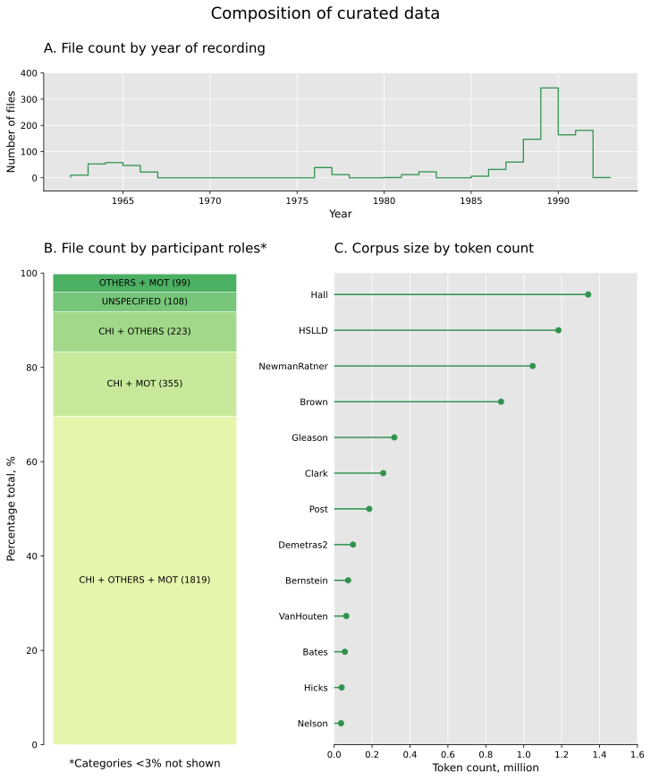
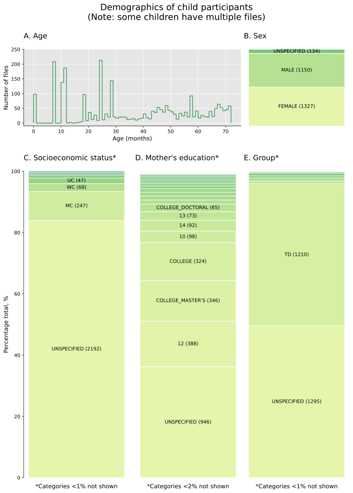
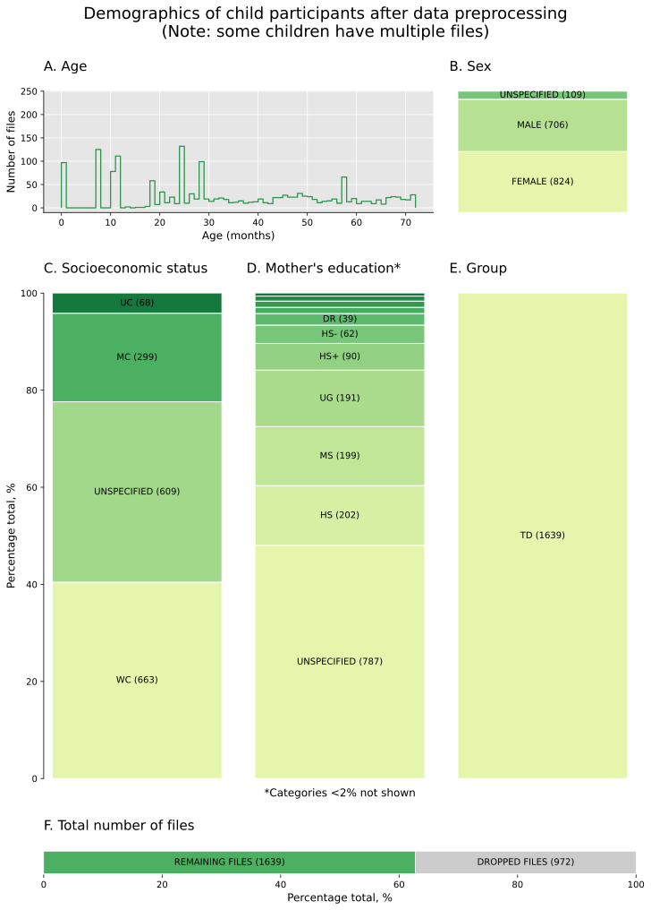
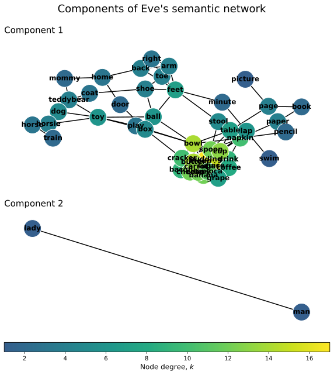

# Analysis of lexical semantic network growth in children from different socio-economic backgrounds

by Man Ho Wong, University of Pittsburgh  
May 1st, 2022

---

# 1 Background

## 1.1 Introduction

A mother's educational background and socio-economic status (SES) have been shown to have significant influence on the child's early vocabulary development. For example, children coming from families of higher SES generally have larger vocabulary size than children from families of lower SES at the same age during early development. Although vocabulary size is a key indicator of early language development, vocabularies of children from different backgrounds may also differ in other dimensions, such as vocabulary diversity and structural complexity. However, most current studies on this topic focus on vocabulary size and we have very limited knowledge about how the socio-economic background affects vocabulary development in other dimensions. To fill the research gap, the main goal of this project is to characterize the vocabulary structure in children of different SES by analyzing the lexical semantic network (a structure representing relations between words). Additionally, the lexical semantic network of maternal child-directed speech (CDS) was also examined to look for correlations between the mother's and the child's vocabulary.

## 1.2 Project development

The project started quite amibitiously in the beginning: I was planning to integrate the data from two online databases, [CHILDES](https://childes.talkbank.org/) (see next section) and [WordBank](http://wordbank.stanford.edu/). Tokens in WordBank come from the [MacArthur-Bates Communicative Development Inventories (MB-CDIs)](https://mb-cdi.stanford.edu/), which are used in many studies to evaluate a child's vocabulary size. To fairly compare vocabularies of children from different studies in CHILDES, I planned to first estimate the vocabulary size of each child in CHILDES with the same CDI standard by matching the tokens in CHILDES to those CDI tokens in WordBank. Ideally, this could possibly be a more naturalistic and reliable way of assessing a child's vocabulary than traditional parent-report questionnaires.

After getting the CDI-vocabulary, I planned to quantify the growth of CDI-vocabulary size of each child from different family backgrounds to check if any SES effects can still be observed in data merged from multiple studies in CHILDES. I would then compare the age of acquisition (AOA) of each CDI word to the frequency of the corresponding word in the maternal CDS to look for any correlations between the mother's and the child's vocabulary. I also planned to characterize the child speech (CS) and the CDS by using common word count-based metrics (e.g., mean length of utterance (MLU), type-to-token ratio (TTR), noun-to-verb ratio (NTVR) and word frequency by lexical categories). However, as mentioned above, getting the CDI-vocabulary involves integrating data from the two databases. This would nearly be unaccomplishable in a time frame of less than three months as it would involve annotating thousands of files, not to mention that a lot of recordings in CHILDES do not have enough words for an accurate evaluation of a child's CDI-vocabulary. Because of these restrictions, I decided not to integrate the two databases but just use CHILDES as my data source for this project. Without evaluating vocabularies by a common standard like CDI, comparison of child vocabularies from different datasets by word count-based metrics would not be fair. Therefore, I changed my plan from word count-based analysis to lexical semantic network analysis.

Lexical semantic network analysis focuses on word-word relationships. Differences in semantic networks have been found in children of various developmental conditions, such as in typically developed children or in late talkers. However, to my knowledge, no studies have looked at the effects of SES on lexical semantic network growth during development. I took this project as a chance to explore the potential of studying the effects of SES on vocabulary development with semantic network analysis. In this project, I demonstrated how a semantic network analysis can be performed fairly with data merged from different studies. I also showed that semantic network analysis provides a possible way to analyze a child's vocabulary development with only a subset of the child's vocabulary. For a summary of some interesting observations found in this project, please see the [Summary](#6-summary) section. 

For reference, the original project plan can be found [here](https://github.com/Data-Science-for-Linguists-2022/Child-Vocab-Development/blob/main/project_plan.md).

---

# 2 Data sourcing

The data curation process of the project is documented in [`data_curation.ipynb`](https://github.com/Data-Science-for-Linguists-2022/Child-Vocab-Development/blob/main/code/data_curation.ipynb). 

## 2.1 CHILDES

Data used in this project was downloaded from the online speech database, Child Language Data Exchange System (CHILDES). 
>MacWhinney, B. (2000). The CHILDES Project: Tools for analyzing talk. Third Edition. Mahwah, NJ: Lawrence Erlbaum Associates.

CHILDES is the child language component of TalkBank maintained by Brian MacWhinney at Carnegie Mellon University, Pittsburgh, USA. It is a multilingual database containing corpora with transcriptions, audio recordings and/or video recordings of child speech (CS) and child-directed speech (CDS) at different developmental stages. The recording transcripts in the database are stored in CHAT formats. ([Example](https://childes.talkbank.org/access/Eng-NA/Brown.html)). CHILDES is licensed under Creative Commons License (CC BY-NC-SA 3.0).

## 2.2 PyLangAcq package

The python package PyLangAcq was used to read CHAT files as suggested by Prof. Na-Rae Han. See [`data_curation.ipynb`](https://github.com/Data-Science-for-Linguists-2022/Child-Vocab-Development/blob/main/code/data_curation.ipynb) for demonstration.

## 2.3 Corpora used in this project

North American English was chosen as the target language for this project because of its abundant data available online. There are 47 North American English corpora in CHILDES (see TalkBank's [browsable database](https://sla.talkbank.org/TBB/childes); also listed in `data/data_samples/childes/eng_NA_corpus_list.csv`). For this project, I collected the transcripts for both the CS and the associated CDS from the following 13 corpora in CHILDES: Bates, Bernstein, Brown, Clark, Demetras2, Gleason, HSLLD, Hall, Hicks, Nelson, NewmanRatner, Post and VanHouten. These corpora fulfill the requirements of this study (see below).

## 2.4 Data search strategy

Dataset curation was documented in [`data_curation.ipynb`](https://github.com/Data-Science-for-Linguists-2022/Child-Vocab-Development/blob/main/code/data_curation.ipynb). Briefly, I screened for suitable CHAT files in three phases. In the first phase, I narrowed down the scope of search by identifying the relevant corpora fitting a set of basic criteria:
- Participants: data includes child or mother
- Child information: data contains child age, sex and socioeconomic status (SES) information
- Mother information: data contains SES or education information

The above information can be found in the header of each CHAT file. For efficiency, not all files were read and screened:  Handling all corpora at once as one PyLangAcq `Reader` object is not memory-efficient, but reading each single CHAT file into individual `Readers` does not allow parallelized reading and parsing, and thus is less time-efficient. Therefore, instead of reading all corpora at once or reading each CHAT file one by one,  CHAT files in each corpus were read and evaluated parallelly each time. Besides, as long as a CHAT file in a corpus meets the above criteria, the corpus would be included in the next phase of data screening and the remaining files in the corpus will not be read (because  files from the same corpus are supposed to come from the same study contain similar header information).

13 corpora were identified in the first phase of data search. These corpora were then downloaded to the local drive. In the second phase, all CHAT files in the identified corpora were screened and only those meeting the above criteria were kept. In addition to the previous criteria, I also narrowed the age range of the child participants down to 6 years old. In the third phase, the curated dataset was refined throughout the data processing pipeline. The CHAT files meeting the search criteria were indexed by their header information and the index was stored in a Python DataFrame called `data_idx`. `data_idx` was pickled and stored locally for further data processing and analysis. The list of corpora identified was also pickled as a Python list `search_result` for quicker re-run of the data search directly from the second phase.

To organize a CHAT file's header information in `data_idx`, I created the following variables: 
- `mot_edu`: mother's education level 
- `group`: child's developmental group, e.g. typically developed
- `ses`: child's SES (socioeconomic status; same as mother's)
- `situation`: situation of recording (e.g. play session)
- `activities`: activities during recording (e.g. Toy play)
- `study_type`: type of study (e.g. longitudinal study)

### Data before cleaning and processing

The figure below shows the composition of the curated dataset before data preprocessing.

The figure below shows the demographics of the child participants in the dataset before data preprocessing. Note that each child participant involved in longitudinal studies may have multiple files in the dataset. Those files from the same participant were recorded at different time points and thus were treated as separate data points in this project.

As shown above in the participant demographics, different corpora use different sets of labels and definitions for the same variable (e.g. mother's education). Besides, some files were not needed for this project (e.g. children in developmental groups other than typical development). Therefore, the dataset curated was cleaned before further analysis by using coherent variable definitions in `data_idx` and removing unneeded files.

---

# 3 Data cleaning

The curated dataset was further processed to prepare the data for linguistic analysis later. The figure below shows the demographics of the child participants in the dataset after data preprocessing.

In summary, the following changes were made to the index of the dataset (`data_idx`):
1. Similar `mot_edu` labels in `data_idx` were merged and changed to custom labels.
2. All entries in `data_idx` were labeled as `TD` (typical development) for the variable `group`.
3. Similar `SES` labels were merged and changed to three classes: `WC` (working class), `MC` (middle class) and `UC` (upper class).
4. Unknown labels were marked as `unspecified`.
5. Entries collected from children of adolescent mothers were dropped.
6. Entries containing recordings from less naturalistic situations or maternal interviews (without CDS) were dropped.
7. A unique child ID was created for each entry.

For details, see [`data_preprocessing.ipynb`](https://github.com/Data-Science-for-Linguists-2022/Child-Vocab-Development/blob/main/code/data_preprocessing.ipynb).

After data preprocessing, 972 entries were dropped and there are 1639 remaining entries. The processed dataset was indexed by a DataFrame called `data_idx_processed`.

---

# 4 Exploratory data analysis

The quality of the processed dataset was evaluated using mean length of utterance (MLU, see next section) in [`exploratory_analysis.ipynb`](https://github.com/Data-Science-for-Linguists-2022/Child-Vocab-Development/blob/main/code/exploratory_analysis.ipynb). Besides, the limitations of the dataset were also identified for further data cleaning. The objectives of this section are summarized as follow: 
1. To identify the tools available for measuring MLU:
    - Assess the tools available in the `PyLangAcq` package and identify their limitations
    - Develop custom functions specifically designed for this project
2. To evaluate the quality and limitations of the processed dataset with MLU:
    - Is the sample size sufficient?
    - Is the sample distribution balanced so that fair comparison between different groups can be made?
    - Is vocabulary development still observable in the combined dataset consisting of multiple corpora?

## 4.1 Evaluating dataset with MLU

A common way to measure a child's linguistic productivity is to look at the child's mean length of utterance (MLU). In general, MLU increases with age during early development. It can be measured by morphemes (MLU-m) or by words (MLU-w):  
`MLU-m = total number of morphemes / total number of utterances` or  
`MLU-w = total number of words / total number of utterances`  

The accuracy of MLU depends on the overall quality of the data, which relies on: 
- correctly parsed speech
- sample size (total number of utterances)

Therefore, by measuring MLU, we can assess whether the quality of the processed dataset is good enough for the study of vocabulary development: we should be able to see an increase in MLU during development. In addition, if SES has any effects on early vocabulary development, it should be reflected by differences in MLU among different SES groups.

MLU can be computed with the MLU functions in the `PyLangAcq` package. However, there are a few limitations which make them unsuited for this project. For example, these functions count the punctuation period (.) as a word; sometimes an empty string is counted as a morpheme (periods, gestures or actions are annotated as empty string in some corpora). Consequently, the number of words or utterances could be overestimated. Besides, the `PyLangAcq` functions only return average values: you cannot get the distribution of utterance length, nor the median length (MdLU) or other MLU variants such as MLU5-w (mean length of five longest utterances by words).

To overcome the limitations of `PyLangAcq` functions, custom functions were used to calculate MLU in this project. The functions are stored in [`./etc/pittchat.py`](https://github.com/Data-Science-for-Linguists-2022/Child-Vocab-Development/blob/main/code/etc/pittchat.py).

## 4.2 Comparing MLU-m between children of different SES

I first compared the MLU-m between children of different SES (upper class UC, middle class MC and working class WC). MLU-w was not measured because MLU-m was sufficient to reveal the effects of SES.

The figure above shows that MLU increases with age regardless of the child's SES. This suggests that the age effect on MLU was preserved in the dataset after preprocessing, demonstrating that the quality of the dataset was sufficient to reveal the age effect. In addition, a possible effect of SES on MLU can also be observed. Comparing the overall trends of MLU between different SES groups, UC has the highest MLU and WC has the lowest within the same age range.

While the data quality is sufficient to reveal developmental changes, however, the dataset has a very imbalanced sample distribution for different SES groups:

In the above figure, each dot represents a sample (i.e. a CHAT file) in the dataset. Most of the samples in the WC group are older than 40 months, while there are much fewer samples for UC. For fair comparison, the following analyses will only be done in the range of **20 to 42 months** where WC and MC have similar sample distribution and where most UC samples are included. This is also the age range when the difference in vocabulary size among children of different SES was observed in other studies.

Note that some time points seem to have an unusually large sample size. These samples could possibly come from corpora where participant age was well-matched, or from repeated recordings of the same individual participants.

## 4.3 Checking effects of recording length on MLU

One thing we need to consider when combining different datasets is that samples may have different recording lengths, which may affect the measurement of MLU. For example, samples with short duration provide only a "cross-sectional" view of a participant's linguistic productivity, and therefore the measured MLU may not reflect the overall linguistic productivity of the participant. To check whether the length of recording has an impact on the measurement of MLU and thus distorts the observed age or SES effect on vocabulary development, I measured three additional variants of MLU which are calculated based on different numbers of utterances (MLU100-m and MLU5-m) or variance instead of median utterance length:
- **MLU100-m**: MLU-m of first 100 utterances
- **MLU5-m**: MLU-m of first 5 utterances
- **VLU-m**: Variance of utterance length by morpheme

The figure above shows that similar effects of age and SES could be observed in all the four variants of MLU, although the degree of effects might be different with different measurements. This demonstrates that, with suitable analysis, it is possible to uncover the effects of age and SES on vocabulary development even if the dataset contains samples of different recording lengths. 

To summarize, this section demonstrated that the quality of the processed datasset was sufficient for further analysis by showing that MLU increases during development and SES likely has an effect on MLU. Looking at the sample distribution by participant's age, I decided to focus on the age range of 20 to 42 months for further analysis. With different variants of MLU, I also showed the effects of age and SES on vocabulary development can be observed even the dataset consists of samples of different recording lengths. Together, the above results show that the key features of early vocabulary development such as changes in MLU remain observable in a combined dataset consisting of multiple corpora.

---

# 5 Vocabulary analysis

This section is documented in [`vocabulary_analysis.ipynb`](https://github.com/Data-Science-for-Linguists-2022/Child-Vocab-Development/blob/main/code/vocabulary_analysis.ipynb).

## 5.1 Vocabulary as a lexical semantic network

Currently, many studies on early vocabulary development rely on measuring vocabulary growth by token or morpheme counting, such as the mean length of utterance as we have discussed in the last section, or vocabulary size by number of words. To the best of my knowledge, no studies have investigated the word-word relationships during development in children of different SES groups. This section aims to explore the potential of analyzing the word-word relationships in different SES groups with lexical semantic network analysis.

## 5.2 Getting word embeddings from ConceptNet

Relationships between words in a lexicon can be represented by how similar they are in their semantic meanings. There are many metrics to measure word-to-word similarity. In general, these metrics can be derived from two different sources: human-annotated datasets (e.g. WordNet), or word associations learned by machine algorithms (e.g. word2vec). Both sources have their pros and cons for different applications. In this project, I used machine-generated word associations for the calculation of word-to-word similarity because it is more flexible (e.g. getting different word associations by using different training data) than human-annotated datasets and is probably less prone to human biases (when training data are curated carefully). Besides, human-annotated datasets are based on formal taxonomies of words and such knowledge is unlikely to be present in a young child's world.

There are two main types of machine-learning models to generate word associations, count-based and prediction-based models. In this project, word similarity were computed from word embeddings based on a semantic network called **ConceptNet**, which is a network built by both count-based and prediction-based models. The most unique feature about ConceptNet is that, unlike other semantic networks, it is concept-based rather than word-based (though nodes are still represented by words or phrases). For mapping word relations in a young child's lexicon where word meanings are closely related to the concepts which they are acquiring at the same time, this concept-based feature probably makes ConceptNet more suitable for this project than word embeddings derived from other models.

## 5.3 Pipeline for constructing lexical semantic network

Below are the steps of the pipeline used for constructing the lexical semantic network from each participant's word list in each CHAT file. This pipeline was applied to all CHAT files in the dataset.
1. Extract tokens from a CHAT file
2. Import ConceptNet-Numberbatch word vectors
3. Map each word in the word list to its word vector
4. Compute pairwise word similarity (cosine similarity) from word vectors
5. Construct a semantic network using cosine similarities as the weights of edges

Due to time constraints and computing resources, I did not train my own model to get the word vectors. Instead, I used a pre-trained dataset, ConceptNet-Numberbatch, to get the word vectors. It can be downloaded from their official GitHub. In this project, I used the Gensim package to process word vectors. The figure below shows the word vectors generated from a file in the 'Eve' dataset from the Brown Corpus.

To construct a semantic network, we need to know the word similarity between every possible pair of words. As far as I know, Gensim can only compute cosine similarity between a pair of words one at a time. Therefore, I used a Scikit-learn function called `pairwise.cosine_similarity`, to compute the pairwise cosine similarity. A matrix of cosine similarities was generated from the word vectors in each CHAT file. As an example, the following figure shows the cosine similarity matrix generated from the 'Eve' dataset.

In a semantic network, words are the nodes and they are linked by edges representing word similarity between two words. For this project, I chose to work with the NetworkX library because of its ease of use in Python and a large collection of algorithms for network analysis.

For the similarity threshold ($\varepsilon$), I will use the value 0.19 as suggested by 
>Amatuni and Bergelson (2017). Semantic Networks Generated from Early Linguistic Input. BioRxiv 157701; doi: https://doi.org/10.1101/157701.

Below is a semantic network constructed from the 'Eve' dataset with NetworkX:

Note that a child may produce "words" that are not found in their native language as creating new words is very common among young children. Such words may not be found in ConceptNet and this may generate errors. This is generally referred to as an out-of-vocabulary (OOV) problem. To handle these words, I simply removed them from the list, although it may be necessary to develop a better strategy to handle OOV words in the future.

## 5.4 Semantic network analysis

In the following analysis, I quantified the network properties of each semantic network with the following common metrics:
- number of nodes
- number of edges
- average degree (K)
- average shortest path length (L)
- average local clustering coefficient (C)

The number of nodes gives us an idea about the size of a semantic network. The other metrics tell us about the overall connectivity of the network. In addition, average shortest path length (L) and average local clustering coefficient (C) also allow us to quantify global and local connectivity of the network.

One thing we should consider when computing L and C is that some semantic networks may contain disconnected components. For example, in Eve's semantic network, there are two disconnected components:

Depending on the sizes (here: number of nodes) of the disconnected components, the value of C can vary a lot. Therefore, I also looked at C of the largest component (C0) in addition to the whole network's C. Besides, L cannot be computed from networks containing disconnected components because there are no paths between nodes of different components. Therefore, I only computed the L for the largest component (L0).

### 5.4.1 Effects of semantic network size on network properties

As discussed in the last notebook, the curated dataset contains samples of different recording lengths. Therefore, semantic networks constructed from different samples were expected to have different sizes in terms of node number. For fair comparison, we should limit our analysis to networks of similar size. To examine how the network size influences the measurement of other network properties, I inspected the interaction between node number and L0 , as well as between node number and C0 .

The figure above shows an interesting non-linear interaction between node number and L0 or C0 . L0 increases as the network grows in size while C0 decreases, but both values stop changing and become stable when the network size reaches at around 50 nodes, suggesting that global and local connectivity are stabilized when the network grows to a certain size. This is itself an intriguing phenomenon worth further investigation in the future. Nevertheless, this is beyond the scope of this project and I will focus on SES's effects on semantic networks in the following analysis.

Semantic networks can be quantified in many ways by different metrics. Some network properties are closely related with each other and computing all of the related properties is not necessarily more informative. For example, node number is directly proportional to the average degree (k) in my dataset:

Therefore, I included only four most informative network properties in the following analysis:
- Average degree, K
- Average shortest path length (largest component), L0
- Average local clustering coefficient, C
- Average local clustering coefficient (largest component), C0

Moreover, since the values of L0 and C0 become independent of node number when the semantic network has around 50 nodes or more as shown previously, I included only networks of more than 50 nodes in the analysis for fair comparison between networks of different sizes.

### 5.4.2 Effects of SES on semantic network

In this section, I analyzed the lexical semantic networks in the child speech (CS) and in the maternal child-directed speech (CDS) of different SES groups.

For child's semantic networks (CS), SES seems to specifically affect only the average degree but not other network properties. The average degree increases during development in MC and UC children, but not in WC children. As noted earlier, node number (i.e. number of words in the semantic network) is directly proportional to the average degree. Therefore, a higher average degree indicates larger vocabulary size. This observation agrees with the larger vocabulary size observed in UC children in other studies.

The unchanged L and C during development show that global and local connectivity of a growing semantic network is very stable regardless of the SES, suggesting that the small-world characteristic of semantic networks is preserved during development.

The results here also indicate that the average degree of a semantic network could be used as a proxy for vocabulary size, despite each network in the dataset containing only a subset of the child's vocabulary. Measuring average degree of a child's semantic network is potentially more efficient and naturalistic than measuring a child's vocabulary size through parent reporting using standardized word lists such as the MB-CDIs adopted in many studies on early vocabulary development. It would be helpful in the future to explore the possibility of assessing vocabulary size by semantic network average degree.

For semantic networks in the maternal CDS, the network properties seem to be minimally influenced by SES. Specifically, the difference in average degree between MC and WC mothers is not as obvious as what we observed in children. Unfortunately, the sample size for UC was not sufficient to see any effects of SES. 

To see if there is any correlation between the effects of SES on the CS and the CDS, only the files containing both the CS and the CDS were included in the analysis. Since the sample size was not sufficient enough to study the correlation in different age groups separately, I looked at the overall correlation in all samples regardless of age.

Two observations can be made from the above figure. First, the interaction between the CS and the CDS is likely different in MC and WC. In general, K for CS is higher in MC than in WC within the same range of K for the CDS, while C, C0 and L0 for the CS is lower in MC than in WC. Second, there is a positive relationship between the CS and the CDS, though the relationship seems to be weaker in WC for K. These observations suggest that the overall network connectivity of the CS is likely modulated by that of the CDS and the degree of modulation differs between MC and WC.

---

# 6 Summary

This project performed semantic network analysis on the dataset curated from CHILDES by first constructing the lexical semantic networks from individual CHAT files in the dataset. The following observations were made from the lexical semantic networks in the CS and the CDS:
- The average shortest path length (L) and average local clustering coefficient (C) did not change with node number in the networks containing more than 50 nodes, suggesting that the global and local network connectivity of a semantic network are fairly stable even when new nodes are added to the network.
- L and C also did not change during development, suggesting that the global and local network connectivity are stable over time during early vocabulary development.
- The average degree (K) could potentially be used as a proxy for vocabulary size in the assessment of early vocabulary growth.
- The overall network connectivity of the CS was likely modulated by that of the CDS.

Due to time constraints, the above observations were not tested statistically. Besides, the sample size may not be sufficient to draw conclusions from the observations. The inherently small size of semantic networks in children also makes it difficult to perform some common types of network analysis, such as the degree distribution. Nevertheless, despite the limitations of the dataset, this project demonstrates the possibility of studying early vocabulary development with semantic network analysis using a combined source of data.

